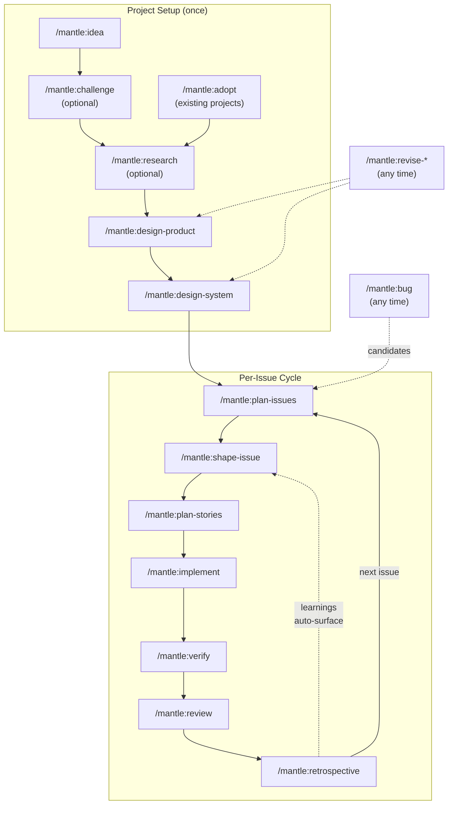

# Mantle — Product Design

## Vision

A single-install tool that gives AI coding agents persistent memory, idea validation, and structured product development — from idea through to reviewed code. Install once, run `/mantle:idea`, and the workflow guides you. Existing projects run `/mantle:adopt` to reverse-engineer design docs from their codebase. All context lives in `.mantle/` (git-native) and an optional Obsidian vault (cross-project knowledge). Python orchestrates deterministically; AI implements creatively.

---

Mantle (PyPI: `mantle-ai`, CLI: `mantle`)

Named after the geological mantle — the deep layer beneath the earth's surface. Your Obsidian vault is the mantle: the rich context layer that powers everything above it. Adjacent to obsidian (volcanic glass originates from the mantle).

## Problem Statement

AI coding agents are powerful but fundamentally broken in three ways:

1. **Stateless sessions** — Every conversation starts from zero. Context is lost between sessions, forcing users to repeat themselves or manually maintain state through copy-pasting into notes.
2. **No idea validation** — AI agents rubber-stamp bad ideas. They agree with whatever the human proposes, producing well-engineered solutions to problems that shouldn't be solved. Code generation is cheap. Good ideas are expensive.
3. **Fragmented knowledge** — Learnings, decisions, skills, and project context live in scattered files with no connections between them. An agent working on Project B can't leverage lessons from Project A.

Current tools (GSD, Aider, Cursor) solve code generation but none solve the upstream problem: ensuring you're building the right thing, with persistent context that compounds over time.

## Solution

A single-install tool that gives your AI agent a memory, a knowledge graph, and the discipline to challenge your ideas before building them.

### Target User

Technical developers who use Claude Code and want structured, AI-assisted product development with persistent, interconnected context.

Not: non-technical users, enterprise teams, or people who need a GUI (though the architecture should not preclude a future UI layer).

### The Workflow

| Phase | Command | What Happens |
|---|---|---|
| **Idea** | `/mantle:idea` | User logs an idea to the project vault with structured metadata. Captured as a note, not lost in chat history. |
| **Adopt** | `/mantle:adopt` | For existing projects. Parallel agents analyze the codebase and research the domain, then an interactive session reverse-engineers product and system design documents from what already exists. Bridges into the planning workflow. |
| **Challenge** | `/mantle:challenge` | Optional single interactive session. AI weaves through five lenses (assumption surfacing, first-principles analysis, devil's advocate, pre-mortem, competitive analysis) based on conversation flow — challenging the idea from multiple angles rather than rubber-stamping it. Produces a structured verdict with confidence level and assumptions table. |
| **Research** | `/mantle:research` | Optional research session using web search and web fetch to validate technical feasibility, investigate existing solutions, and explore technology options. Produces a structured research report in `.mantle/research/`. Multiple rounds supported for iterative investigation. |
| **Product Design** | `/mantle:design-product` | Interactive session defining the what and why: features, target users, success metrics, genuine edge. Creates `.mantle/product-design.md`. |
| **System Design** | `/mantle:design-system` | Interactive session defining the how: architecture, tech choices, API contracts, data model. Every decision logged with rationale, alternatives, confidence, and reversal cost. Creates `.mantle/system-design.md`. |
| **Revise Design** | `/mantle:revise-product` / `/mantle:revise-system` | Separate commands for updating existing designs. Each revision creates a decision log entry capturing what changed and why. Keeps create and update concerns focused for optimal AI output. |
| **Bug Capture** | `/mantle:bug` | Quick structured bug capture during any session. Saved to `.mantle/bugs/` with severity and reproduction steps. Open bugs are surfaced by `/mantle:plan-issues` as candidates for new issues. |
| **Plan Issues** | `/mantle:plan-issues` | Work broken into vertical slices cutting across product layers. AI proposes one issue at a time — user approves or adjusts each before the next is proposed. Surfaces open bugs as issue candidates. Each slice delivers testable functionality. |
| **Shape Issue** | `/mantle:shape-issue` | Before decomposing an issue into stories, evaluate 2-3 approaches with tradeoffs, rabbit holes, and no-gos. Commit to a direction with a fixed appetite. Shaped artifacts saved to `.mantle/shaped/`. |
| **Plan Stories** | `/mantle:plan-stories` | Each issue decomposed into implementable stories sized for AI implementation. Stories include both what to implement and what tests to write (TDD: tests are a natural extension of story functionality). |
| **Implement** | `/mantle:implement` | Prompt-based orchestrator: for each story, spawn a native Claude Code Agent subagent with file paths to read, run tests, retry once with error feedback on failure, git commit, update story status via CLI. Each story gets a fresh 200k context window with full tool access. |
| **Verify** | `/mantle:verify` | Project-specific verification strategy. On first invoke, prompts user to define how this project should be verified (example project, localhost, integration tests, etc.). Per-issue overrides in acceptance criteria. |
| **Review** | `/mantle:review` | Human reviews completed work via checklist. AI presents acceptance criteria with pass/fail status from verification. Human marks each as approved/needs-changes with comments. |
| **Retrospective** | `/mantle:retrospective` | After implementation, capture structured learnings (what went well, harder than expected, wrong assumptions, recommendations) with a confidence delta. Saved to `.mantle/learnings/`. Learnings auto-surface in future shaping sessions. |

The workflow is fluid — revise commands exist to update designs, add new issues, and log new decisions at any point. It's a set of tools that maintain structure while allowing iteration, not a rigid pipeline.

### Workflow Diagram

The primary flow runs top-to-bottom from idea to reviewed code. Per-issue cycles repeat until all planned work is complete. Learnings from each retrospective automatically surface in future shaping sessions, creating a compounding feedback loop.

Solid lines show the primary flow. Dotted lines show feedback loops and side-channel inputs. The learning loop from retrospective to shaping is the key mechanism — each completed issue makes future planning smarter.

### The Knowledge Engine

- **Skill graph**: Interconnected notes in a personal vault linking skills, projects, patterns, and lessons learned via Obsidian wikilinks and YAML frontmatter. An agent working on a caching problem can discover you solved a similar problem in a previous project.
- **Session logs**: Structured records of what was done, decisions made, and what's next — written automatically at the end of every session. Enables instant context restoration.
- **Auto-briefing**: On session start, a compiled briefing auto-displays: project state + last session log + open blockers + next actions. Zero-friction context restore — you never start from zero.
- **Decision logs**: Every architectural and product decision recorded with rationale, alternatives considered, confidence level, and reversal trigger. Six months from now, "why did we choose FastAPI?" has an answer.
- **Compiled context**: Vault state compiled into Claude Code commands so the AI gets pre-loaded knowledge instantly, not raw file queries at runtime. Inspired by Colin's context compilation pattern.
- **Skill detection**: AI suggests new skill nodes when it spots skills used during implementation that aren't in the graph. `/mantle:add-skill` command for manual creation.

### Design Principles

1. **Obsidian-native, not Obsidian-abstracted** — Deep integration with Obsidian CLI and vault features. Obsidian is the product, not a swappable backend.
2. **Minimal required structure** — `state.md` + `decisions/` to get started. Everything else optional. Don't make the tool feel like busywork.
3. **Context should be compiled, not queried** — Pre-bake vault state into commands where possible. Lazy-load the rest. Respect context budgets.
4. **AI illuminates tradeoffs, humans decide** — The tool surfaces options and consequences. It never makes the call.
5. **Core as library** — All logic lives in a core module that knows nothing about Claude Code or CLIs, enabling a future UI layer without a rewrite.
6. **Session logs are automatic** — Every session is logged. Casual sessions can contain valuable insights. Context restoration should be effortless.
7. **Prompt orchestrates, AI implements** — The implementation loop is a prompt-based orchestrator (`implement.md`) that spawns native Agent subagents per story. Each agent gets a fresh 200k context window with full tool access. Python handles state management (story status updates via CLI); orchestration logic lives in the prompt.
8. **One command, one job** — Each command does one focused thing to give the AI optimal context. Separate commands for create vs update. No overloaded multi-purpose commands.

### Differentiators

| vs Tool | Mantle's Edge |
|---|---|
| **GSD** | GSD ships a TypeScript SDK runtime (`sdk/src/`: session-runner, context-engine, cli-transport, event-stream, tool-scoping) and is the closest competitor by surface area. Mantle's edge is **persistent cross-project knowledge** via an Obsidian-native vault — a wikilinked skill graph that compounds across projects, not a per-repo planning store. The second edge is a **cohesive idea-to-review lifecycle** — challenge → research → design → plan → shape → implement → verify → review → retrospective as one connected pipeline, with each stage's artefacts feeding the next. |
| **Aider** | Aider is a pair programmer for individual coding tasks. Mantle manages the full lifecycle from idea validation through to verified, reviewed code. |
| **Colin** | Colin compiles context into skills (one-way). Mantle reads AND writes — it's a bidirectional workflow engine with interactive sessions, implementation loops, and vault state management. |
| **Cursor / IDE tools** | IDE tools operate at the code level. Mantle operates at the product level — ensuring you're building the right thing before you write any code. |

## User Stories

### Setup & Onboarding

1. As a developer, I want to install Mantle with a single command (`uv tool install mantle-ai`), so that there are no multi-step or multi-package installs to manage.
2. As a developer, I want `mantle install --global` to mount all commands, agents, and hooks into my `~/.claude/` directory, so that Claude Code immediately recognises `/mantle:*` commands.
3. As a developer, I want `mantle init` in my project repo to create `.mantle/` with an interactive onboarding message (e.g., "Run /mantle:idea to get started"), so that I know what to do next.
4. As a developer, I want `mantle init` to prompt me about setting up a personal vault for cross-project skills, so that I'm aware of the feature without it being mandatory.
5. As a developer joining an existing project, I want to clone the repo and immediately have access to all project context in `.mantle/`, so that I don't need a separate sync setup.
6. As a developer joining an existing project, I want to run `mantle install --global` once, and then Claude Code auto-displays a project briefing on session start, so that I can understand the project state without asking anyone.
49. As a developer with an existing project, I want to run `/mantle:adopt` and have AI agents analyze my codebase and research the domain, so that I can onboard into Mantle without manually writing design documents from scratch.
50. As a developer with an existing project, I want the adoption to be interactive — presenting findings for me to correct and refine — so that generated artifacts reflect my intent, not just what the code implies.
51. As a developer with an existing project, I want reverse-engineered design documents that follow the same schema as Mantle's design commands, so that `/mantle:plan-issues` and `/mantle:plan-stories` work immediately after adoption.

### Idea Capture

7. As a developer, I want to run `/mantle:idea` and have an interactive session that captures my idea with structured metadata (hypothesis, target user, success criteria), so that ideas are preserved as structured notes rather than lost in chat.
8. As a developer, I want ideas saved as markdown files in `.mantle/idea.md` with YAML frontmatter, so that they're versioned in git and readable by any tool.

### Challenge & Validation

9. As a developer, I want to run `/mantle:challenge` and have the AI challenge my idea from multiple angles (devil's advocate, pre-mortem, competitive analysis) in a single interactive session, so that weak ideas are identified before I invest in building them.
10. As a developer, I want the challenge session to adapt its questioning based on conversation flow rather than following a rigid checklist, so that the critique feels like a genuine discussion with a thoughtful skeptic.
11. As a developer, I want the challenge phase to be optional, so that I can skip it when I already have a validated idea or am working on an obvious improvement.

### Product & System Design

12. As a developer, I want `/mantle:design-product` to run an interactive session that produces a structured product design document (features, target users, success metrics, edge), so that the "what and why" is captured before any code is written.
13. As a developer, I want `/mantle:design-system` to run an interactive session that produces a system design document (architecture, tech choices, API contracts, data model), so that the "how" is planned with explicit tradeoffs.
14. As a developer, I want every decision made during system design to be logged automatically to `.mantle/decisions/` with rationale, alternatives, confidence, and reversal triggers, so that future contributors know why things were built a certain way.
15. As a developer, I want `/mantle:revise-product` to read the current product design and open an interactive revision session, so that designs can be updated as understanding evolves.
16. As a developer, I want `/mantle:revise-system` to read the current system design and open an interactive revision session, so that technical decisions can be revisited without rewriting the entire document.
17. As a developer, I want every design revision to automatically create a decision log entry capturing what changed and why, so that design evolution is traceable.

### Bug Capture

52. As a developer, I want to run `/mantle:bug` during a session to quickly capture a bug with structured metadata (severity, reproduction steps, related files), so that bugs are logged immediately rather than forgotten.
53. As a developer, I want bugs saved as dated markdown files in `.mantle/bugs/` with YAML frontmatter, so that they accumulate as a trackable backlog versioned in git.
54. As a developer, I want `/mantle:plan-issues` to surface open bugs when I start a planning session, so that I can decide whether to address them as part of the next batch of work.
55. As a developer, I want bugs linked to the issue that fixes them via a `fixed_by` field, so that I can trace from bug discovery through to resolution.

### Planning

18. As a developer, I want `/mantle:plan-issues` to propose vertical slice issues one at a time, waiting for my approval or adjustment on each before proposing the next, so that I have fine-grained control over how work is decomposed.
19. As a developer, I want each issue to include acceptance criteria that define "done" in testable terms, so that verification is objective.
20. As a developer, I want `/mantle:plan-stories` to break each issue into stories that include both implementation tasks and test expectations (TDD approach), so that tests are a natural extension of story functionality.
21. As a developer, I want stories sized for a single Claude Code session (one context window), so that implementation is predictable and doesn't degrade with context length.
56. As a developer, I want `/mantle:shape-issue` to guide me through evaluating 2-3 approaches before decomposing into stories, so that I commit to a direction with understood tradeoffs.
57. As a developer, I want shaped issues saved with YAML frontmatter capturing approaches, chosen approach, appetite, and open questions, so that planning rationale is preserved.
58. As a developer, I want past learnings loaded during shaping sessions, so that I don't repeat mistakes from previous issues.

### Implementation

22. As a developer, I want `/mantle:implement` to orchestrate implementation by spawning native Agent subagents for each story in a given issue, so that each story gets a fresh 200k context window with full tool access.
23. As a developer, I want each completed story to result in an atomic git commit, so that I can revert individual stories if needed.
24. As a developer, I want the implementation loop to automatically skip stories already marked "completed" on re-run, so that resumption after a failure is seamless.
25. As a developer, I want the loop to retry once with error feedback when tests fail for a story, so that transient AI mistakes are automatically corrected.
26. As a developer, I want the story to be marked "blocked" with failure details if the retry also fails, so that I can diagnose and fix the issue manually.
27. As a developer, I want Mantle to automatically create a git worktree and branch when implementing an issue, so that parallel issues don't conflict.
28. As a developer, I want Mantle to merge the worktree branch back when an issue is verified and reviewed, so that completed work integrates cleanly.

### Verification & Review

29. As a developer, I want `/mantle:verify` to prompt me for my project's verification strategy on first use (e.g., "run against example project", "test on localhost", "run integration tests"), so that verification is tailored to my project, not generic.
30. As a developer, I want a project-level default verification strategy stored in `.mantle/config.md`, so that I don't re-specify it for every issue.
31. As a developer, I want per-issue verification overrides in the issue's acceptance criteria, so that special issues can have custom verification steps.
32. As a developer, I want `/mantle:review` to present a checklist of acceptance criteria with pass/fail status from verification, so that I can make an informed approve/needs-changes decision per criterion.
33. As a developer, I want to add comments to individual review items, so that feedback is specific and actionable.

### Learning

59. As a developer, I want `/mantle:retrospective` to guide me through a structured reflection after completing an issue, so that implementation learnings are captured.
60. As a developer, I want learnings to include a confidence delta, so that I can track how each issue affected project confidence.
61. As a developer, I want learnings automatically surfaced in future `/mantle:shape-issue` sessions, so that past experience informs future planning.

### Context & Session Continuity

34. As a developer, I want a compiled project briefing to auto-display when I start a Claude Code session in a Mantle project, so that I never start from zero.
35. As a developer, I want the briefing to include project state, last session log, open blockers, and next actions, so that I have complete context in one shot.
36. As a developer, I want `/mantle:resume` available as a command for mid-session context refresh, so that I can re-orient if a session goes off track.
37. As a developer, I want session logs written automatically at the end of every session (not just sessions using `/mantle:*` commands), so that casual sessions with valuable insights are captured.
38. As a developer, I want session logs capped at ~200 words, so that they stay useful and don't bloat the vault.
39. As a developer, I want `/mantle:status` to show the current project state compiled from vault data, so that I can get a quick overview without reading multiple files.

### Skill Graph & Knowledge

40. As a developer, I want `/mantle:add-skill` to create a skill node in my personal vault with metadata (proficiency, related skills, projects), so that I can build a cross-project knowledge graph.
41. As a developer, I want the AI to suggest creating a skill node when it detects I'm using a technology that isn't in my skill graph, so that the graph stays current without manual effort.
42. As a developer, I want relevant skill nodes loaded during implementation (matched by `skills_required` in state.md), so that the AI can leverage cross-project learnings.
43. As a developer, I want my personal vault to sync via iCloud, so that I can capture quick ideas from my phone.

### Collaboration

44. As a developer on a team, I want every Mantle-created note stamped with the author's `git config user.email`, so that I know who made which decisions.
45. As a developer on a team, I want `/mantle:resume` to filter session logs to my own sessions, so that I see my own context, not a coworker's.
46. As a developer on a team, I want `.mantle/` committed to git and reviewable in PRs, so that design rationale is reviewed alongside code changes.
47. As a developer reviewing a PR, I want to see `.mantle/decisions/` changes in the diff, so that I understand why architectural choices were made.

### Help & Discovery

48. As a new user, I want `/mantle:help` to list all available commands grouped by workflow phase, so that I can discover capabilities without reading documentation.

## Release Milestones

Each milestone represents a complete user workflow — something a user can install and actually use end-to-end. Push to master after each issue; tag a release when a milestone is complete.

### v0.1.0 — Foundation (issues 1–2) ✅

`mantle init` → `.mantle/` created, state machine active, personal vault optional.

| Issue | Title | Status |
|-------|-------|--------|
| 01 | Package skeleton, CLI entry point, mantle install | completed |
| 02 | Project initialization (mantle init + personal vault) | completed |

**What the user can do**: Install mantle, initialise a project, set up a personal vault. The plumbing works but there's no workflow yet.

### v0.2.0 — Idea & Validation (issues 3–4) ✅

`/mantle:idea` → `/mantle:challenge` → idea captured and stress-tested.

| Issue | Title | Status |
|-------|-------|--------|
| 03 | Idea capture (`/mantle:idea`) | completed |
| 04 | Challenge session (`/mantle:challenge`) | completed |

**What the user can do**: Capture a structured idea and have the AI challenge it from multiple angles before investing in design.

### v0.3.0 — Design & Research (issues 5–7, 18) ✅

`/mantle:research` → `/mantle:design-product` → `/mantle:design-system` → research-informed designs with decision logging.

| Issue | Title | Status |
|-------|-------|--------|
| 05 | Product design (`/mantle:design-product`) | completed |
| 06 | System design + decision logging (`/mantle:design-system`) | completed |
| 18 | Research command (`/mantle:research`) | completed |
| 07 | Design revision (`/mantle:revise-product` + `/mantle:revise-system`) | completed |
| 19 | Project adoption (`/mantle:adopt`) | completed |

**What the user can do**: Full idea-to-design workflow. Product and system design documents with every decision logged and traceable. Research building blocks through first-principles decomposition. Revise designs as understanding evolves. Existing projects can adopt Mantle and generate design docs from their codebase.

### v0.4.0 — Context & Continuity (issues 8–10, 17) ✅

Auto-briefing, session logs, and skill graph — the knowledge engine.

| Issue | Title | Status | Depends on |
|-------|-------|--------|------------|
| 08 | Context compilation engine + `/mantle:status` | completed | 02 |
| 09 | Session logging | completed | 02 |
| 10 | Auto-briefing on session start (`/mantle:resume`) | completed | 08, 09 |
| 17 | Skill graph (`/mantle:add-skill`) | completed | 02 |

**What the user can do**: Persistent context across sessions. Start a session and get an instant briefing. Build a cross-project skill graph. Never start from zero again.

### v0.4.1 — Skill Usability Patch (issue 21)

Validate skill links, add content tags, compile skills to `.claude/skills/` for native Claude Code loading.

| Issue | Title | Status | Depends on |
|-------|-------|--------|------------|
| 21 | Skill usability fixes (validation, tagging, Claude Code loading) | planned | 17 |

**What the user can do**: Skills created via `/mantle:add-skill` are now usable by Claude Code out of the box. Related skill links are validated during creation. Content-based tags enable Obsidian graph discovery. Skills are compiled to `.claude/skills/` so Claude Code natively loads them.

### v0.5.0 — Planning & Implementation (issues 11–14, 20, 22–23) ✅

`/mantle:plan-issues` → `/mantle:shape-issue` → `/mantle:plan-stories` → `/mantle:implement` → `/mantle:retrospective` → automated build loop with structured reflection.

| Issue | Title | Status | Depends on |
|-------|-------|--------|------------|
| 11 | Issue planning (`/mantle:plan-issues`) | completed | 02 |
| 12 | Story planning (`/mantle:plan-stories`) | completed | 11 |
| 13 | Implementation orchestration loop (`/mantle:implement`) | completed | 12 |
| 14 | ~~Worktree parallel implementation~~ | dropped | 13 |
| 20 | Bug capture (`/mantle:bug`) | completed | 02 |
| 22 | Shape issue (`/mantle:shape-issue`) | completed | 11 |
| 23 | Retrospective (`/mantle:retrospective`) | completed | 22 |

**What the user can do**: Full planning-to-code pipeline. Break work into vertical slices, shape issues with tradeoff analysis, decompose into stories, and run an automated implementation loop with per-story context windows, test retries, and atomic commits. Capture bugs on the fly and surface them during planning. Structured retrospectives after each issue with learnings that auto-surface in future shaping.

### v0.6.0 — Verification & Review (issues 15–16) ✅

`/mantle:verify` → `/mantle:review` → verified and reviewed code.

| Issue | Title | Status | Depends on |
|-------|-------|--------|------------|
| 15 | Verification (`/mantle:verify`) | completed | 02 |
| 16 | Review (`/mantle:review`) | completed | 15 |

**What the user can do**: Complete lifecycle from idea to reviewed code. Project-specific verification strategies with per-issue overrides. Human review with acceptance criteria checklist.

### v0.7.0 — Code Quality (issue 24)

`/mantle:simplify` → post-implementation quality gate for AI-generated code.

| Issue | Title | Status | Depends on |
|-------|-------|--------|------------|
| 24 | Simplify command (`/mantle:simplify`) | completed | 13 |

**What the user can do**: Run a dedicated simplification pass after implementation to identify and remove characteristic AI-generated code bloat. Issue-scoped mode targets files changed by an issue's stories. Standalone mode works on any changed files. Per-file agents apply an LLM bloat pattern checklist. Test-gated — changes only committed if tests pass.

## Out of Scope

- **Project management features**: No Gantt charts, team assignments, sprints, or resource allocation. Mantle is a context engine, not a PM tool.
- **Multi-backend support**: No Notion, no other note-taking apps. Obsidian-native by design. One-way Notion export is a potential future feature, not v1 scope.
- **MCP server**: v1 uses Claude Code's native tools + Obsidian CLI. MCP can be added later as a thin wrapper over `core/vault.py` if cross-tool support (Cursor, Windsurf) is needed.
- **SaaS / hosted mode**: Local-first, runs on your machine. No cloud infrastructure.
- **Session log consolidation**: Monthly digests of old session logs. Not needed until the vault has a year of usage.
- **Canvas generation**: Programmatic `.canvas` files for skill graph and architecture visualisation. Useful but not essential for v1.
- **Domain workflow customisation**: YAML-based configurable workflow phases for non-software domains. Architecture supports it, but v1 is software development only.
- **Kanban board auto-update**: Auto-updating `board.md` for Obsidian Kanban plugin. Nice-to-have visual, not essential for the workflow.

## Further Notes

### Future Extensibility

- **UI layer**: Core is a Python library. A web UI can call the same functions the CLI calls. Non-technical users (e.g., business planners) could use Mantle through a web interface while the vault remains the source of truth.
- **One-way Notion export**: A `/mantle:sync-notion` command could push project state and issues to a Notion database for team visibility.
- **MCP server**: When vault operations via Bash become unreliable or cross-tool support is needed, `core/vault.py` can be wrapped in an MCP server with ~50 lines of code.

### Open Questions

- How should the personal vault skill graph interact with `.mantle/` project context when multiple team members have different personal vaults? (The current answer: personal vault is private, project vault is shared. They link via `skills_required` in state.md but don't merge.)
- ~~Should there be a `/mantle:retrospective` command for end-of-project reflection?~~ Resolved: Shipped in v0.5.0 (issue 23). Captures structured learnings with confidence delta after each issue. Learnings auto-surface in future `/mantle:shape-issue` sessions.
- What's the right behaviour when Obsidian CLI is unavailable (not installed, wrong version)? (Current answer: filesystem fallback for all operations. Log a warning.)
