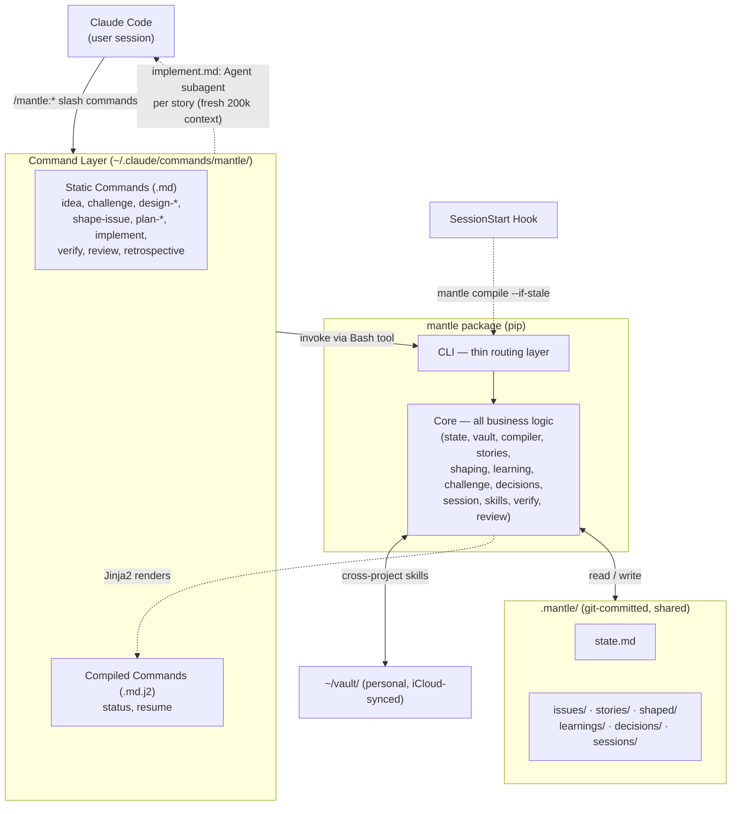

# Mantle — System Design

## Vision

Python library (`core/`) with thin CLI and future UI layers. Core never imports from delivery layers. Static markdown commands mounted into `~/.claude/`, compiled commands rendered from vault state via Jinja2. Obsidian CLI with filesystem fallback. `.mantle/` in-repo for collaboration via git; personal vault (`~/vault/`) optional for cross-project skills. Implementation loop: prompt-based orchestrator (`implement.md`) spawns native Claude Code Agent subagents per story with fresh 200k context windows, test retries, and atomic commits. Python handles state management (story status updates via CLI).

---

## Implementation Decisions

### Architecture

- **Core as library**: All logic lives in `mantle/core/` which knows nothing about Claude Code, CLIs, or web servers. The CLI (`mantle/cli/`) is a thin consumer. Future UI (`mantle/api/`) would be another thin consumer.
- **Prompt orchestrates, AI implements**: The implementation loop is a prompt-based orchestrator (`implement.md`) that spawns native Agent subagents per story. Each agent gets a fresh 200k context window with full tool access. Python handles state management (story status updates) exposed via CLI subcommands.
- **Compiled + static commands**: Most commands are static markdown files. Compiled commands (`status`, `resume`) are rendered from vault state via Jinja2 templates. Compilation runs automatically via SessionStart hook.
- **Obsidian CLI primary, filesystem fallback**: Official Obsidian CLI (v1.12+) for template application, property management, search, and queries. Direct filesystem read/write as fallback when CLI is unavailable.
- **In-repo project context**: `.mantle/` lives in the project's git repo. Collaboration via git (PRs, branches, diffs). Personal vault (`~/vault/`) is separate and syncs via iCloud.
- **Git identity tagging**: Every note stamped with `git config user.email`. No custom identity system.
- **One command, one job**: Each command does one focused thing. Separate commands for create vs update (e.g., `design-product` vs `revise-product`) to keep AI context tight.

### Modules

Deep modules (complex internals, simple interfaces):

| Module | Interface | Complexity Hidden |
|---|---|---|
| `core/vault.py` | `read_note()`, `write_note()`, `search()`, `update_properties()` | Obsidian CLI vs filesystem fallback, YAML frontmatter parsing, path resolution between `.mantle/` and `~/vault/` |
| `core/compiler.py` | `compile(project_path)`, `compile_if_stale(project_path)` | Jinja2 rendering, content hashing manifest, staleness detection, context budgeting |
| `core/stories.py` | `run_update_story_status()`, `save_stories()`, `load_stories()` | Story CRUD, status updates with YAML frontmatter editing, tag management. Implementation orchestration moved to `implement.md` prompt. |
| `core/state.py` | `load()`, `update()`, `transition()` | State machine validation, multi-author conflict handling, git identity resolution |

Thin modules (straightforward wiring):

| Module | What It Does |
|---|---|
| `core/session.py` | Read/write session logs, latest session retrieval with author filtering |
| `core/decisions.py` | Create decision log entries with structured metadata |
| `core/skills.py` | CRUD on skill nodes in personal vault, gap detection against `skills_required`, skill loading for context |
| `core/verify.py` | Load verification strategy (project-level + per-issue), run checks, build report |
| `core/review.py` | Build checklist from acceptance criteria + verification results |
| `core/adopt.py` | Adoption orchestration: parallel agent dispatch, artifact generation, state updates |
| `core/challenge.py` | Save/load/list challenge transcripts with auto-increment filenames, state.md updates |
| `core/shaping.py` | Save/load/list shaped issues with per-issue overwrite, state.md updates |
| `core/learning.py` | Save/load/list learnings with confidence_delta validation, state.md updates |
| `core/manifest.py` | File hash tracking for staleness detection |
| `core/templates.py` | Jinja2 template rendering |

### Key Interactions

- `cli/` calls `core/` functions. Never the reverse.
- `core/` never imports from `cli/` or `api/`.
- Claude Code commands (markdown files) invoke `mantle` CLI commands via Bash tool when they need runtime operations.
- The SessionStart hook calls `mantle compile --if-stale` to refresh compiled commands, then the compiled `resume.md` auto-displays the project briefing.



Solid lines show the normal request flow (top-down). Dotted lines show the three special patterns: the SessionStart hook triggers compilation, compiled commands are rendered from vault state via Jinja2, and `implement.md` spawns native Agent subagents per story (each getting a fresh 200k context window with full tool access).

### Project Status vs Issue/Story Status

The project has a single lifecycle status in `state.md` (idea → ... → completed). Issues and stories have their own independent statuses.

**Relationship**: Project status represents the *current workflow phase*, not a rollup of issue statuses. During `implementing`, multiple issues may exist in different states — some `implemented`, some `planned`, one `implementing`. The project status advances manually (or via command) when the user moves to a new phase, not automatically when all issues reach a threshold.

**Why not automatic**: A project in `implementing` may have Issue-3 verified while Issue-4 is mid-implementation. The user decides when to transition to `verifying` (perhaps after all planned issues are done, or after a subset). This keeps the state machine simple and avoids complex rollup logic that would need to handle partial completion, deferred issues, and priority changes.

**Tracking fields**: `current_issue` and `current_story` in `state.md` track what's actively being worked on. These are updated via CLI subcommands during implementation and cleared between sessions.

### Error Handling

- **Implementation failure**: On test failure, the `implement.md` orchestrator spawns a retry Agent with the error output. If the retry also fails, the story is marked "blocked" via `mantle update-story-status` with failure details and the loop stops.
- **Obsidian CLI unavailable**: All vault operations fall back to direct filesystem read/write. A warning is logged but nothing breaks.
- **State conflicts**: `state.md` uses git identity to track `updated_by`. Merge conflicts in `.mantle/` are resolved via git's normal merge flow.

## Testing Decisions

### What Makes a Good Test

Tests should verify external behaviour through the module's public interface, not implementation details. If you can refactor the internals without breaking tests, the tests are well-written. If changing a private method breaks a test, the test is too coupled.

### Modules Under Test

Every module in `core/` gets tests:

| Module | Test Strategy |
|---|---|
| `core/vault.py` | Unit tests with a temporary directory as a mock vault. Test Obsidian CLI calls via subprocess mocking. Test filesystem fallback by simulating CLI absence. |
| `core/compiler.py` | Unit tests: provide vault state fixtures, verify rendered command output matches expected markdown. Test staleness detection with hash manifest fixtures. |
| `core/stories.py` | Unit tests: save/load round-trip, status updates with YAML frontmatter editing, tag management, issue linking. Orchestration logic is in `implement.md` (not testable via pytest). |
| `core/state.py` | Unit tests: load/save state from fixture files. Test state machine transitions (e.g., `idea` → `challenge` is valid, `idea` → `implementing` is not). |
| `core/session.py` | Unit tests: verify session log format, briefing compilation, author filtering. |
| `core/decisions.py` | Unit tests: verify decision log entry format, frontmatter structure, file naming. |
| `core/skills.py` | Unit tests: CRUD operations with content round-trips, wikilink rendering, slug normalization, gap detection against `skills_required`, skill loading for context. |
| `core/verify.py` | Unit tests: verify strategy loading from config.md and per-issue overrides. Test report generation. |
| `core/review.py` | Unit tests: verify checklist construction from acceptance criteria + verification results. |
| `core/challenge.py` | Unit tests: save/load round-trip, auto-increment filenames, IdeaNotFoundError, state.md updates, list/exists queries. |
| `core/shaping.py` | Unit tests: save/load round-trip, per-issue overwrite, frontmatter validation, state.md updates, list queries. |
| `core/learning.py` | Unit tests: save/load round-trip, confidence_delta validation, state.md updates, list queries. |
| `core/manifest.py` | Unit tests: hash computation, staleness comparison, manifest read/write. |
| `core/templates.py` | Unit tests: Jinja2 rendering with fixture contexts. |

### Test Tooling

- **Framework**: pytest
- **Fixtures**: Temporary vault directories with pre-built `.mantle/` structures
- **Mocking**: `subprocess.run` mocked for Obsidian CLI and git operations
- **No LLM calls in tests**: Orchestration logic lives in `implement.md` (prompt-based). Python tests cover state management and story CRUD, not the orchestration flow.
- `inline_snapshot` and `dirty-equals` are available for exact-output capture and structural comparison respectively (see CLAUDE.md Test Conventions).

## Distribution & Installation

Single install via pip/uv with an installer that mounts files into Claude Code's directory structure.

```bash
uv tool install mantle-ai       # Install package + CLI
mantle install --global          # Mount commands, agents, hooks into ~/.claude/
```

Update:

```bash
uv tool upgrade mantle-ai && mantle install --global
```

Published to PyPI as `mantle-ai`. No Claude Code marketplace, no separate installs, no version sync issues.

### What `mantle install` Does

Copies files into Claude Code's directory structure (GSD pattern):

```
~/.claude/
├── commands/mantle/       # Slash commands (/mantle:idea, /mantle:challenge, etc.)
├── agents/                # Subagent definitions (researcher, implementer)
├── hooks/                 # Session hooks (context compilation, auto-briefing)
└── settings.json          # Hook registrations (merged, not overwritten)
```

Also writes a manifest (`mantle-file-manifest.json`) tracking installed file hashes to detect user modifications on upgrade.

### What `mantle init` Does

Initializes Mantle in a project repo:

```bash
cd my-project
mantle init                # Creates .mantle/ in current repo
```

After creation, prints an interactive onboarding message:

```
Mantle initialized in .mantle/

  Your project is ready. Next steps:
  - New project? Run /mantle:idea to log your first idea
  - Existing project? Run /mantle:adopt to generate design docs from your codebase
  - Run /mantle:help to see all commands

  Would you like to set up a personal vault for cross-project skills?
  Run: mantle init-vault ~/vault
```

```
my-project/
├── src/                   # Existing code
├── .mantle/               # Project context (committed to git)
│   ├── state.md
│   ├── config.md          # Project-level settings (includes verification strategy)
│   ├── tags.md            # Tag taxonomy reference
│   ├── decisions/
│   ├── sessions/
│   └── .gitignore         # Ignores compiled/temp files
└── ...
```

### Personal Vault Setup

For cross-project knowledge (skills, patterns, inbox). Optional but prompted during `mantle init`.

```bash
mantle init-vault ~/vault          # Creates personal vault structure
mantle config set personal-vault ~/vault
```

```
~/vault/                           # Personal vault (iCloud-synced)
├── skills/                        # Skill graph (cross-project)
├── knowledge/                     # Learnings and patterns
└── inbox/                         # Quick captures from mobile
```

The personal vault syncs via iCloud (or any file sync). Project context lives in the repo. Everything works without a personal vault — skill linking and cross-project knowledge are bonus features.

## Package Structure

```
mantle/
├── pyproject.toml
├── src/
│   └── mantle/
│       ├── core/                          # Universal engine (library)
│       │   ├── adopt.py                   # Adoption orchestration (codebase + domain → artifacts)
│       │   ├── vault.py                   # Obsidian vault read/write (CLI + filesystem)
│       │   ├── compiler.py                # Compile vault context into commands
│       │   ├── stories.py                 # Story CRUD and status management
│       │   ├── state.py                   # Project state management
│       │   ├── session.py                 # Session logging & briefing compilation
│       │   ├── challenge.py               # Challenge session prompts & logic
│       │   ├── shaping.py                # Shaped issue save/load/list
│       │   ├── learning.py               # Learning save/load/list with confidence delta
│       │   ├── decisions.py               # Decision logging
│       │   ├── skills.py                  # Skill graph CRUD & gap detection
│       │   ├── verify.py                  # Verification strategy & execution
│       │   ├── review.py                  # Review checklist construction
│       │   ├── manifest.py                # Dependency tracking & staleness detection
│       │   └── templates.py               # Template rendering (Jinja2)
│       │
│       ├── cli/                           # Developer delivery (thin layer)
│       │   ├── main.py                    # Cyclopts entry point
│       │   ├── install.py                 # Mount files into ~/.claude/
│       │   ├── init.py                    # Initialize .mantle/ in project repo
│       │   ├── compile.py                 # Compile vault state into commands
│       │   ├── shaping.py                 # CLI wiring for shape-issue
│       │   ├── learning.py                # CLI wiring for retrospective
│       │   ├── skills.py                  # CLI wiring for save-skill
│       │   └── status.py                  # Show project states
│       │
│       └── api/                           # Future: UI delivery (thin layer)
│           └── (empty for now)
│
├── claude/                                # Files mounted into ~/.claude/
│   ├── commands/
│   │   └── mantle/
│   │       ├── adopt.md                   # Static — onboard existing project
│   │       ├── idea.md                    # Static — log an idea
│   │       ├── challenge.md               # Static — interactive challenge session
│   │       ├── design-product.md          # Static — create product design
│   │       ├── design-system.md           # Static — create system design
│   │       ├── revise-product.md          # Static — revise product design + decision log
│   │       ├── revise-system.md           # Static — revise system design + decision log
│   │       ├── plan-issues.md             # Static — plan issues one at a time
│   │       ├── shape-issue.md            # Static — evaluate approaches before story decomposition
│   │       ├── plan-stories.md            # Static — plan stories with test specs
│   │       ├── implement.md               # Static — prompt-based orchestrator (Agent subagents per story)
│   │       ├── verify.md                  # Static — run project-specific verification
│   │       ├── review.md                  # Static — checklist-based human review
│   │       ├── retrospective.md          # Static — capture post-implementation learnings
│   │       ├── add-skill.md               # Static — create skill node in personal vault
│   │       ├── status.md.j2               # Compiled — renders vault state
│   │       ├── resume.md.j2               # Compiled — project briefing (auto-displayed)
│   │       └── help.md                    # Static — list all commands by phase
│   ├── agents/
│   │   ├── codebase-analyst.md            # Codebase exploration for /mantle:adopt
│   │   ├── domain-researcher.md           # Domain landscape research for /mantle:adopt
│   │   ├── researcher.md                  # Research subagent
│   │   └── implementer.md                # Implementation subagent
│   └── hooks/
│       └── session-start.sh               # Compiles context + auto-displays briefing
│
├── vault-templates/                       # Obsidian note templates
│   ├── idea.md
│   ├── product-design.md
│   ├── system-design.md
│   ├── issue.md
│   ├── story.md
│   ├── decision.md
│   ├── session-log.md
│   └── skill.md
│
└── tests/
    ├── test_adopt.py
    ├── test_vault.py
    ├── test_compiler.py
    ├── test_stories.py
    ├── test_state.py
    ├── test_session.py
    ├── test_decisions.py
    ├── test_skills.py
    ├── test_verify.py
    ├── test_review.py
    ├── test_challenge.py
    ├── test_manifest.py
    └── test_templates.py
```

### Architecture Rule

`core/` is a pure Python library. It never imports from `cli/` or `api/`. Everything flows downward.

```python
# This works without Claude Code, without CLI, without any UI
from mantle.core import vault, state, challenge

current = state.load_state(project_dir)
note, path = challenge.save_challenge(project_dir, transcript)
challenges = challenge.list_challenges(project_dir)
```

A future web UI calls the same `core/` functions. The CLI and UI are thin delivery layers.

## Directory Structures

### Project Context (In-Repo)

Lives in `.mantle/` inside the project's git repo. Shared with the team via git.

```
my-project/
├── src/
├── tests/
├── .mantle/                               # Project context (committed to git)
│   ├── state.md                           # Current status + metadata (REQUIRED)
│   ├── config.md                          # Project-level settings + verification strategy
│   ├── tags.md                            # Tag taxonomy reference
│   ├── idea.md                            # Original idea + hypothesis
│   ├── product-design.md                  # The what and why
│   ├── system-design.md                   # The how
│   ├── decisions/                         # Decision log entries (REQUIRED)
│   │   └── <date>-<topic>.md
│   ├── challenges/                        # Challenge session transcripts
│   │   └── <date>-challenge.md            # Auto-increments: -2, -3 on collision
│   ├── issues/                            # Vertical slice issues
│   │   └── issue-<nn>.md
│   ├── stories/                           # Stories per issue (with test specs)
│   │   └── issue-<nn>-story-<nn>.md
│   ├── shaped/                            # Shaped issue artifacts (approach evaluation)
│   │   └── issue-<nn>-shaped.md
│   ├── learnings/                         # Post-implementation learnings
│   │   └── issue-<nn>.md
│   ├── sessions/                          # Session logs (auto-written, author-tagged)
│   │   └── <date>-<HHMM>.md
│   └── .gitignore                         # Ignores compiled/temp files
├── .claude/
├── .gitignore
└── README.md
```

### Personal Vault (iCloud-Synced)

Cross-project knowledge. Syncs across your devices via iCloud. Not shared with team.

```
~/vault/
├── skills/                                # Skill graph (cross-project)
│   └── <skill-name>.md                    # Skill nodes with frontmatter + wikilinks
├── knowledge/                             # Cross-project learnings
│   ├── patterns.md
│   └── lessons-learned.md
└── inbox/                                 # Quick captures from mobile
```

### How They Connect

Mantle reads from both locations:
- `mantle status` reads `.mantle/state.md` from the current repo
- `/mantle:implement` loads project context from `.mantle/` AND relevant skills from the personal vault
- `/mantle:resume` filters session logs to the current user's `git config user.email`
- The personal vault's skill nodes can reference projects: `projects: [[my-project]]` (display links for Obsidian, not file paths)

### Collaboration via Git

`.mantle/` is committed to the repo like any other directory:

```bash
git add .mantle/decisions/2026-02-22-caching.md
git commit -m "docs(mantle): log caching architecture decision"
git push
```

PR reviews can include `.mantle/` changes — reviewers see design rationale alongside code changes. New team members clone the repo and get full project context immediately.

### Viewing in Obsidian

The `.mantle/` directory can be opened as an Obsidian vault for graph view and backlink navigation:

```bash
# Optional — for visual exploration
obsidian open .mantle/
```

Not required. Files are plain markdown, readable in any editor or GitHub's web UI.

## Note Schemas

### State File (Session Entry Point)

Every command reads this first to understand context.

```yaml
---
schema_version: 1
project: my-project
status: idea | adopted | challenge | product-design | system-design | planning | implementing | verifying | reviewing
confidence: 7/10
created: 2026-02-22
created_by: conal@company.com
updated: 2026-02-22
updated_by: conal@company.com
current_issue: null
current_story: null
skills_required:
  - python
  - fastapi
tags:
  - status/active
---

## Summary
One-paragraph description of the project.

## Current Focus
What's being worked on right now.

## Blockers
> [!warning] Blockers
> - [ ] Open blockers listed here

## Recent Decisions (last 3)
- 2026-02-22: Chose X — [[decisions/2026-02-22-topic]]

## Next Steps
1. What to do next
```

### Decision Log Entry

```yaml
---
date: 2026-02-22
author: conal@company.com
topic: framework-selection
scope: product-design | system-design | architecture | implementation | tooling
confidence: 8/10
reversible: high | medium | low
tags:
  - type/decision
  - phase/system-design
---

## Decision
FastAPI over Flask.

## Alternatives Considered
- Flask: simpler but lacks async, validation
- Django: too heavy for this use case

## Rationale
FastAPI's built-in validation and async support match our requirements.

## Reversal Trigger
If performance testing shows <100 req/sec throughput.
```

### Skill Graph Node

```yaml
---
name: "Python asyncio"
description: "Async Python patterns using asyncio. Use when building concurrent I/O-bound services."
type: skill
proficiency: "7/10"
related_skills: [Python, FastAPI]
projects: [mantle]
last_used: 2026-03-02
author: conal@company.com
created: 2026-03-02
updated: 2026-03-02
updated_by: conal@company.com
tags:
  - type/skill
---

## Related Skills

- [[Python]]
- [[FastAPI]]

## Projects

- [[mantle]]

<!-- mantle:content -->
## Context

Async Python patterns using asyncio for concurrent I/O-bound services.

## Core Knowledge

Use `asyncio.TaskGroup` for structured concurrency instead of `gather()`.

## Decision Criteria

Use asyncio for I/O-bound concurrency. Use multiprocessing for CPU-bound work.

## Anti-patterns

- Use `TaskGroup` instead of `gather()` for structured concurrency.
```

The `description` field is the most important metadata — it determines whether a skill gets activated and loaded into context. Written in third person, includes both what the skill covers and when it's relevant.

`related_skills` and `projects` store plain names in frontmatter; the body renders them as `[[wikilinks]]` in header sections. A `<!-- mantle:content -->` marker separates generated wikilink sections from authored content, enabling safe content extraction during updates.

Skill content is dense, imperative knowledge written for Claude's consumption (not a human tutorial). The `/mantle:add-skill` command coaches the user through authoring and includes a research phase using the researcher agent to complement personal knowledge with current best practices.

#### Skill Link Validation

During the `/mantle:add-skill` workflow, each `related_skills` entry is validated against existing vault skills using `skill_exists()`. Missing links trigger a per-link prompt: create a stub (minimal node with 0/10 proficiency), remove the link, or keep the dangling reference. Validation happens at workflow time, not save time, so users can act on warnings interactively.

#### Content-Based Tags

Skills receive content tags beyond `type/skill`:

- **Topic tags** (`topic/X`): One per skill, reflecting the skill's subject. E.g., `topic/python-asyncio`, `topic/rest-api-design`.
- **Domain tags** (`domain/X`): Broader category. E.g., `domain/web`, `domain/database`, `domain/concurrency`.

Tags are AI-driven: during the `/mantle:add-skill` workflow, the AI reads `.mantle/tags.md`, reuses existing tags where appropriate, and proposes new ones for user confirmation. New tags are appended to `tags.md` via `core/tags.py`. This keeps the taxonomy growing organically rather than relying on a hardcoded lookup. `type/skill` is always enforced in code regardless of what tags are passed.

#### Skill Compilation to `.claude/skills/`

`mantle compile` syncs vault skills to Claude Code's native skill directory format ([skill docs](https://code.claude.com/docs/en/skills)). Each compiled skill is a directory with `SKILL.md` as the entrypoint:

```
.claude/skills/<skill-slug>/
├── SKILL.md           # Main instructions (required, <500 lines)
└── reference.md       # Overflow content if skill exceeds 500 lines (optional)
```

`SKILL.md` uses Claude Code's YAML frontmatter for discovery and invocation control:

```yaml
---
name: python-asyncio
description: "Async Python patterns using asyncio. Use when building concurrent I/O-bound services."
user-invocable: false
---
```

Key compilation rules:

- **Frontmatter mapping**: Vault `name` (slugified) → `name`, vault `description` → `description`, always `user-invocable: false` (vault skills are background knowledge, not slash commands). Vault-specific metadata (`proficiency`, `related_skills`, `projects`, `tags`, wikilink sections) is omitted.
- **Content**: Only the authored content (after `<!-- mantle:content -->` marker) is compiled. Obsidian wikilink sections are stripped.
- **Progressive disclosure**: If authored content exceeds 500 lines, essential sections (Context, Core Knowledge, Decision Criteria) go in `SKILL.md` and remaining sections (Examples, Anti-patterns) go in `reference.md` with a cross-reference link.
- **Description quality**: The `description` field drives Claude Code's skill discovery (loaded at 2% of context window, ~16,000 chars budget across all skills). Must describe what the skill covers AND when it's relevant, under 200 chars.
- **Project-level only**: Compiled to `.claude/skills/` (not `~/.claude/skills/`) because `skills_required` is per-project.
- **Stale cleanup**: Skills removed from `skills_required` or deleted from the vault have their `.claude/skills/` directory removed on each compile.
- **Gitignored**: Compiled skills are personal vault content, not project source (added to `.claude/.gitignore`).

Compilation is triggered by:
- The SessionStart hook (alongside command compilation)
- `/mantle:add-skill` after saving a new skill (immediate availability)

### Session Log (Auto-Written)

```yaml
---
project: my-project
author: conal@company.com
date: 2026-02-22T14:30
commands_used: [challenge, design-product]
tags:
  - type/session-log
---

## Summary
Completed challenge rounds and began product design.

## What Was Done
- Devil's advocate challenge: idea survived with revised positioning
- Started product design: defined v1 feature set

## Decisions Made
- Position as structlog plugin, not standalone library

## What's Next
- Complete product design (success metrics undefined)

## Open Questions
- Should we support create_task in v1 or defer to v2?
```

### Issue (Vertical Slice)

```yaml
---
title: Context propagates across TaskGroup
status: planned | implementing | implemented | verified | approved
slice: [core-propagation, structlog-processor, tests, example]
story_count: 4
verification: null  # Per-issue override, or null to use project default
tags:
  - type/issue
  - status/planned
---

## Acceptance Criteria
- User creates a ContextTaskGroup, binds structlog context, spawns 3 tasks
- All 3 tasks emit logs with the bound context
- Example script demonstrates this end-to-end

## Verification Override
(Optional: per-issue verification instructions that override project default)
```

### Story (with Test Specs)

```yaml
---
issue: 1
title: Implement ContextTaskGroup with contextvars copy
status: planned | in-progress | completed | blocked
failure_log: null  # Populated on block with error details
tags:
  - type/story
  - status/planned
---

## Implementation
Create `ContextTaskGroup` class that copies current contextvars context
into child tasks. Single file: `src/structlog_context/taskgroup.py`.

## Tests
- Test that context dict is available in child task
- Test that context changes in child don't leak to parent
- Test that multiple child tasks get independent copies
```

### Shaped Issue

```yaml
---
issue: 11
title: Issue planning
approaches:
  - name: Approach A
    summary: Description of approach A
    tradeoffs: [tradeoff 1, tradeoff 2]
    rabbit_holes: [risk 1]
    no_gos: []
  - name: Approach B
    summary: Description of approach B
    tradeoffs: [tradeoff 1]
    rabbit_holes: []
    no_gos: [constraint 1]
chosen_approach: Approach A
appetite: 2 sessions
open_questions:
  - Unresolved question 1
author: conal@company.com
created: 2026-02-26
updated: 2026-02-26
updated_by: conal@company.com
tags:
  - type/shaped
  - phase/shaping
---

## Chosen Approach
Why this approach was selected and key considerations.

## Rabbit Holes
Known risks to watch for during implementation.

## No-Gos
Explicitly out of scope for this issue.
```

### Learning Note

```yaml
---
issue: 11
title: Issue planning
author: conal@company.com
date: 2026-02-26
confidence_delta: +1
tags:
  - type/learning
  - phase/reviewing
---

## What Went Well
- Things that worked as expected or better

## Harder Than Expected
- Things that took more effort than anticipated

## Wrong Assumptions
- Assumptions that turned out to be incorrect

## Recommendations
- Advice for future similar work
```

### Config File

```yaml
---
tags:
  - type/config
---

## Verification Strategy

How this project should be verified when /mantle:verify runs:

- Run: `python -m pytest tests/ -v`
- Run: `python examples/basic_usage.py` and verify output matches expected
- Check: all acceptance criteria from the issue are covered by passing tests

## Personal Vault
path: ~/vault
```

## Obsidian Integration

Primary interface: Official Obsidian CLI (v1.12+).

| Operation | Method |
|---|---|
| Apply note templates | `obsidian templates apply` |
| Read frontmatter | `obsidian properties read` |
| Update frontmatter | `obsidian properties set` |
| Search vault content | `obsidian search content` |
| Query pending tasks | `obsidian tasks pending` |
| Write/create notes | `obsidian files write` |
| List files | `obsidian files list` |
| Run complex queries | `obsidian dev:eval` (JavaScript execution) |
| Get all tags | `obsidian tags all` |

Fallback: Direct filesystem read/write for operations where the CLI is unavailable or Obsidian isn't running. Since notes are plain markdown with YAML frontmatter, all operations can be done via file I/O + PyYAML + Pydantic.

Requirement: Obsidian >= 1.12 installed, CLI added to PATH. `mantle install` verifies this and warns (not errors) if missing. Note: The Obsidian CLI requires a **Catalyst license** ($25 USD one-time). This should be documented in installation/setup guides. The filesystem fallback ensures Mantle works fully without it.

## Obsidian Features Leveraged

| Layer | Feature | Purpose |
|---|---|---|
| **Storage** | Plain markdown files | Everything readable/writable by AI and humans |
| **Structure** | YAML frontmatter (Properties) | Typed, queryable metadata on every note |
| **Connections** | Wikilinks + backlinks | Skill graph, decision-to-design links, cross-project references |
| **Categorisation** | Nested tags | Cross-cutting queries across folders and projects |
| **Sections** | Callouts (`[!warning]`, `[!question]`, `[!danger]`) | Structured, parseable sections for blockers, decisions, risks |
| **Composition** | Transclusion (`![[note#heading]]`) | Dashboard notes that compose from other notes |
| **Querying** | Dataview plugin + Obsidian CLI search | Dynamic views for humans, programmatic queries for AI |
| **Visualisation** | Graph View | Relationship graphs for skill nodes and decision links |
| **Templates** | Obsidian Templates / Templater | Consistent note creation for ideas, issues, decisions, sessions |

### Tag Taxonomy

Stored in `.mantle/tags.md` (in-repo) for reference by both humans and AI:

```
#type/idea
#type/challenge
#type/product-design
#type/system-design
#type/decision
#type/issue
#type/story
#type/session-log
#type/shaped
#type/learning
#type/skill
#type/config

#phase/idea
#phase/adopted
#phase/challenge
#phase/design
#phase/shaping
#phase/planning
#phase/implementing
#phase/verifying
#phase/reviewing

#status/active
#status/completed
#status/blocked
#status/archived

#confidence/high       (7-10)
#confidence/medium     (4-6)
#confidence/low        (1-3)
```

## Context Engineering

### Command Inventory (v1)

| Command | Type | Focus |
|---|---|---|
| `/mantle:adopt` | Static | Onboard existing project — codebase analysis, domain research, interactive artifact generation |
| `/mantle:idea` | Static | Log an idea with structured metadata |
| `/mantle:challenge` | Static | Interactive five-lens challenge session (persona inlined, no subagent) |
| `/mantle:design-product` | Static | Create product design |
| `/mantle:design-system` | Static | Create system design with decision logging |
| `/mantle:revise-product` | Static | Revise product design + create decision log entry |
| `/mantle:revise-system` | Static | Revise system design + create decision log entry |
| `/mantle:plan-issues` | Static | Plan vertical slice issues one at a time |
| `/mantle:shape-issue` | Static | Evaluate approaches before story decomposition |
| `/mantle:plan-stories` | Static | Plan stories with test specs (TDD) |
| `/mantle:implement` | Static | Prompt-based orchestrator — Agent subagents per story |
| `/mantle:verify` | Static | Run project-specific verification |
| `/mantle:review` | Static | Checklist-based human review |
| `/mantle:retrospective` | Static | Capture post-implementation learnings |
| `/mantle:add-skill` | Static | Create/update skill node in personal vault |
| `/mantle:status` | **Compiled** | Bakes current vault state into the prompt |
| `/mantle:resume` | **Compiled** | Project briefing: state + last session + blockers + next actions |
| `/mantle:help` | Static | Lists available commands by workflow phase |

### Compilation

```bash
mantle compile              # Render .j2 templates with current vault state
mantle compile --if-stale   # Only recompile if vault files changed (hash-based)
```

Compilation reads vault state, renders Jinja2 templates, and writes concrete markdown commands to `~/.claude/commands/mantle/`. A manifest tracks source file content hashes for staleness detection.

Triggered automatically via SessionStart hook. The hook also triggers auto-display of the compiled briefing so context is restored before the user types anything.

### Context Budget

| Content | When Loaded | Token Budget |
|---|---|---|
| `state.md` | Always (via compiled commands or direct read) | ~2K |
| `product-design.md` | When in design/planning phases | ~5K |
| `system-design.md` | When implementing | ~5K |
| Current issue + stories | When implementing (loaded per story) | ~3K |
| Relevant skill nodes | Compiled to `.claude/skills/` from `skills_required` in state.md | ~2K each |
| Shaped issue for current issue | When shaping/planning | ~2K |
| Past learnings | When shaping (loaded for patterns) | ~1K each |
| Decision log entries | On demand ("what did we decide about X?") | ~1K each |
| Compiled briefing | Auto-displayed on session start | ~3K |

Baseline: ~10-15K tokens. Leaves 185K+ for actual work.

### Session Logging

Session logs are written automatically at the end of every session. Implementation:

1. Each `/mantle:*` command includes closing instructions: "Write a session log to `sessions/`"
2. A `.claude/rules/session-logging.md` rule provides a standing instruction for sessions where commands aren't used
3. Format is structured (summary, what was done, decisions, what's next, open questions) and capped at ~200 words

The compiled briefing reads only the latest session log for the current user (filtered by `git config user.email`). Older logs are available for reference but don't consume context budget unless explicitly queried.

## Implementation Loop

The `/mantle:implement` command is a prompt-based orchestrator (`implement.md`) that spawns native Claude Code Agent subagents per story. This replaced the original Python subprocess approach (issue 13, story 5).

### How It Works

1. The `implement.md` prompt reads `.mantle/state.md` to verify prerequisites
2. Loads story files from `.mantle/stories/issue-{NN}-story-*.md`
3. For each non-completed story (in order):
   - Marks in-progress via `mantle update-story-status`
   - Spawns a `smart` Agent subagent with file paths to read (system design, issue, story)
   - Agent reads files itself with its fresh 200k context window and full tool access
   - After agent returns, verifies tests pass (`uv run pytest`)
   - On failure: spawns one retry Agent with error output, re-runs tests
   - On success: creates atomic git commit, marks completed via CLI
   - On retry failure: marks blocked with failure log, stops loop

### Why Agent-Based, Not Subprocess

The original design used `subprocess.run(["claude", "--print", ...])` to invoke Claude Code per story. Issue 13 story 5 replaced this with native Agent subagents because:

- **No cold starts**: Agents inherit the session's environment — no re-reading CLAUDE.md, no rediscovering the project.
- **Full tool access**: Agents get all tools (Read, Write, Edit, Bash, Glob, Grep, Agent). Subprocess `--print` mode has limited tool access and no interactivity.
- **User interaction**: When an agent is blocked, it can ask the user. A subprocess cannot.
- **No environment mismatch**: Agents run in the same process with the same MCP servers, permissions, and configuration.
- **Simpler code**: No `claude_cli.py` invocation builder, no `compile_story_context()`, no `compile_retry_context()`. Pass file paths, not compiled content — agents read files themselves.

### What Python Still Handles

- **Story status updates**: YAML frontmatter editing is fragile in prompts. `mantle update-story-status` uses tested Python code (in `core/stories.py`) to reliably update status and tags.
- **Story CRUD**: Save, load, list stories with Pydantic validation.

### Resumability Contract

The orchestrator is designed to be safely re-run at any point:

- **Completed stories are skipped**: The prompt checks each story's status and skips `completed` stories.
- **Blocked stories stop the loop**: A `blocked` story halts the loop. The user fixes the issue manually, sets the story status back to `planned`, and re-runs.
- **Crash mid-story**: The story remains `in-progress`. On re-run, the orchestrator treats `in-progress` the same as `planned` — it spawns a new Agent for that story. The previous partial changes are in the working tree and the agent can see them.

The invariant: a story is only marked `completed` after both its tests pass AND its git commit succeeds.

### Worktree Support

Issue 14 (automated worktree management) was dropped — it was designed around passing `--worktree` to subprocess invocations which no longer exist. Users who want parallel issue implementation can use Claude Code's native `/worktree` command before running `/mantle:implement`. This is a single user action and not worth automating.

## Technology Choices

| Component | Choice | Rationale |
|---|---|---|
| Language | Python 3.14+ | Obsidian ecosystem, uv/pip distribution, Jinja2, YAML parsing |
| CLI framework | Cyclopts | Type-hint driven, auto-generated help, Pydantic-style validation |
| Template engine | Jinja2 | Compiled command rendering |
| YAML parsing | PyYAML | Lightweight YAML parsing for frontmatter (yaml.safe_load/dump) |
| Validation | Pydantic | Schema validation for YAML configs, note frontmatter, and state files |
| Terminal output | Rich | Formatted logging, progress bars, tables for CLI output |
| Package build | Hatchling | Modern, supports artifacts for command files |
| Distribution | PyPI via `uv tool install mantle-ai` | Isolated environment, single command |
| Commands format | Markdown files | Mounted into `~/.claude/commands/mantle/` |
| Vault interaction | Obsidian CLI + filesystem fallback | Native template/property support with resilience |
| Version control | Git | Atomic commits per story, worktrees for parallelism |
| Testing | pytest | Standard, fixtures for vault mocking |

## Build Order

1. Package skeleton — `pyproject.toml`, CLI entry point, `mantle install`
2. Project init — `mantle init` creates `.mantle/` with templates + interactive onboarding
3. Personal vault init — `mantle init-vault ~/vault` (optional, prompted during init)
4. State management — `core/state.py`, state.md read/write, git identity tagging
5. Vault operations — `core/vault.py`, Obsidian CLI + filesystem fallback
6. `/mantle:idea` — First command, creates idea from template
7. `/mantle:challenge` — Interactive multi-angle challenge session
8. `/mantle:design-product` — Interactive product design
9. `/mantle:design-system` — Interactive system design with decision logging
10. `/mantle:revise-product` and `/mantle:revise-system` — Revision commands + decision log entries
10b. `/mantle:adopt` — Codebase analysis + domain research → reverse-engineered design docs (requires 8, 9 schemas)
11. Context compilation — `mantle compile`, manifest, SessionStart hook
12. `/mantle:status` and `/mantle:resume` — Compiled commands, auto-briefing on session start
13. `/mantle:plan-issues` — One-at-a-time issue planning
14. `/mantle:plan-stories` — Story planning with test specs (TDD)
14b. `/mantle:shape-issue` — Shape issue approaches before story decomposition
15. `/mantle:implement` — Prompt-based orchestrator with Agent subagents and retry-with-feedback
16. Worktree support — Auto-create worktree/branch per issue, merge on completion
17. `/mantle:verify` — Project-specific verification strategy (config on first use)
18. `/mantle:review` — Checklist-based human review
18b. `/mantle:retrospective` — Post-implementation learning capture
19. `/mantle:add-skill` — Skill node creation + AI gap suggestion
20. Session log auto-writing — Standing rules + command closing instructions
21. `/mantle:help` — Command listing by workflow phase
